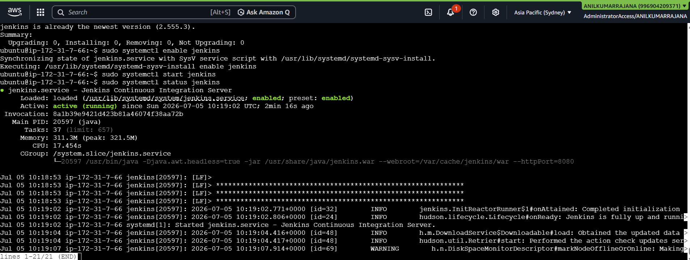
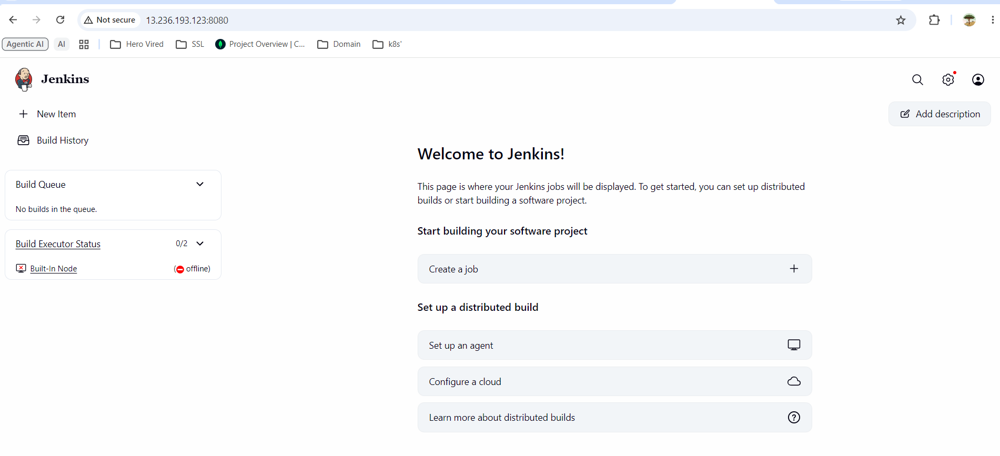
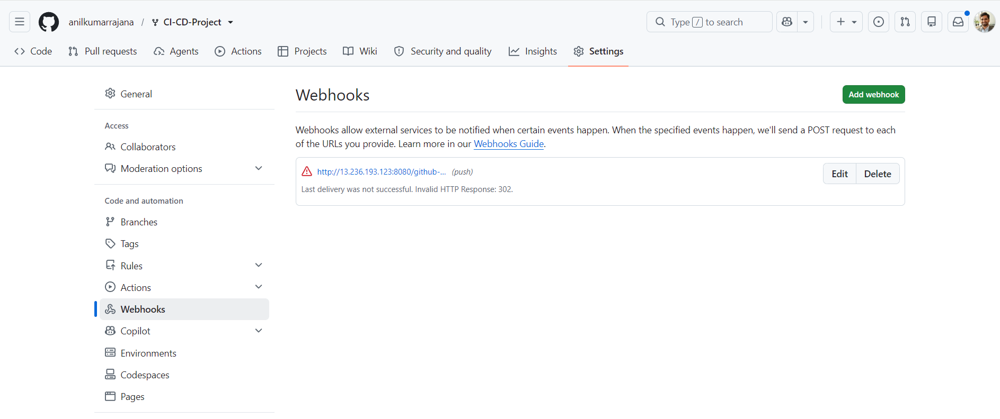
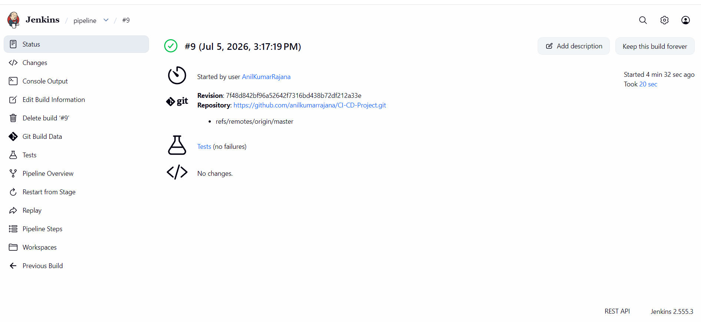
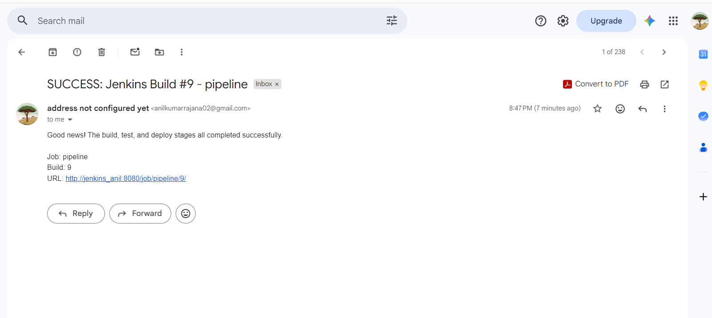

# Flask CI/CD Pipeline with Jenkins

This repository is a fork of [mohanDevOps-arch/flask_Practice](https://github.com/mohanDevOps-arch/flask_Practice.git),
extended with a Jenkins pipeline that automates **build → test → deploy** for the Flask application,
along with automatic build triggers and email notifications.

## Table of Contents
- [Overview](#overview)
- [Prerequisites](#prerequisites)
- [Jenkins Setup](#jenkins-setup)
- [Pipeline Stages](#pipeline-stages)
- [Configuring the Build Trigger](#configuring-the-build-trigger)
- [Configuring Email Notifications](#configuring-email-notifications)
- [Running the Pipeline](#running-the-pipeline)
- [Repository Structure](#repository-structure)
- [Troubleshooting](#troubleshooting)

## Overview

The `Jenkinsfile` in the root of this repository defines a declarative pipeline with three stages:

1. **Build** – creates a Python virtual environment and installs dependencies from `requirements.txt`.
2. **Test** – runs the test suite with `pytest` and publishes JUnit-style test results.
3. **Deploy** – if (and only if) all tests pass and the branch is `main`, the app is started as a
   background process to simulate deployment to a staging environment.

On every completed build, Jenkins sends an email notifying whether the pipeline succeeded or failed.

## Prerequisites

Before running the pipeline, make sure you have:

- A Jenkins server (self-hosted VM, on-prem, or a cloud instance) with admin access.
- **Java 11+** installed on the Jenkins host (required by Jenkins itself).
- **Python 3.8+** and `pip` installed on the Jenkins agent that will execute the pipeline.
- Git installed on the Jenkins agent.
- A forked copy of this repository under your own GitHub account.
- (Optional but recommended) A GitHub Personal Access Token if your fork is private, so Jenkins can
  clone it.
- An SMTP-capable email account (e.g., Gmail with an App Password) for notifications.

## Jenkins Setup

1. **Install Jenkins**
   ```bash
   sudo apt update
   sudo apt install -y fontconfig openjdk-17-jre
   curl -fsSL https://pkg.jenkins.io/debian-stable/jenkins.io-2023.key | sudo tee \
     /usr/share/keyrings/jenkins-keyring.asc > /dev/null
   echo "deb [signed-by=/usr/share/keyrings/jenkins-keyring.asc]" \
     "https://pkg.jenkins.io/debian-stable binary/" | sudo tee \
     /etc/apt/sources.list.d/jenkins.list > /dev/null
   sudo apt update
   sudo apt install -y jenkins
   sudo systemctl enable --now jenkins
   ```
   
2. Browse to `http://<server-ip>:8080`, unlock Jenkins using
   `/var/lib/jenkins/secrets/initialAdminPassword`, and install the suggested plugins.

   
3. Install additional plugins via **Manage Jenkins → Plugins → Available**:
   - Pipeline
   - Git
   - GitHub
   - Email Extension Plugin
4. Install Python tooling on the Jenkins agent:
   ```bash
   sudo apt install -y python3 python3-venv python3-pip
   ```

## Pipeline Stages

| Stage    | What it does                                                             |
|----------|---------------------------------------------------------------------------|
| Checkout | Pulls the latest code from the configured branch of your fork.           |
| Build    | Creates a virtualenv and runs `pip install -r requirements.txt`.          |
| Test     | Runs `pytest`, produces `test-results.xml`, and publishes JUnit results.  |
| Deploy   | Only on `main` and only if tests pass: launches the app as a background process bound to a staging port (`8000` by default), simulating a staging deployment. |

If any stage fails, the pipeline stops immediately and the **post → failure** block sends an email.

## Configuring the Build Trigger

Two supported approaches (the Jenkinsfile includes a polling fallback by default):

**Option A — GitHub Webhook (recommended, near-instant builds)**
1. In your GitHub fork: **Settings → Webhooks → Add webhook**.
2. Payload URL: `http://<your-jenkins-url>/github-webhook/`
3. Content type: `application/json`
4. Trigger on: "Just the push event."
5. In the Jenkins job configuration, check **"GitHub hook trigger for GITScm polling."**




## Configuring Email Notifications

1. **Manage Jenkins → System → Extended E-mail Notification**: set SMTP server, port, and
   credentials (e.g., `smtp.gmail.com`, port `587`, with an App Password).
2. Also fill in the basic **E-mail Notification** section as a fallback for the standard `mail` step.
3. Update the `NOTIFY_EMAIL` environment variable at the top of the `Jenkinsfile` with your address.
4. Emails are sent automatically:
   - On success → confirms Build/Test/Deploy completed.
   - On failure → links directly to the failing console output.

## Running the Pipeline

1. Create a new Jenkins item: **New Item → Pipeline**.
2. Under **Pipeline**, select "Pipeline script from SCM":
   - SCM: Git
   - Repository URL: your fork's URL
   - Branch: `*/master`
   - Script Path: `Jenkinsfile`
3. Save, then click **Build Now** to run it manually the first time.
4. Push a commit to `master` on your fork to confirm the trigger fires automatically afterward.




## Repository Structure

```
CI_CD-Project/
├── app.py                # Flask application entrypoint
├── requirements.txt       # Python dependencies
├──tests/
│   └── init.py
│   └── test_app.py
├── Jenkinsfile             # CI/CD pipeline definition
└──jenkins\
│   └── README.md
│   └── Snapshot Images
│   └── jenkinsfile
```
