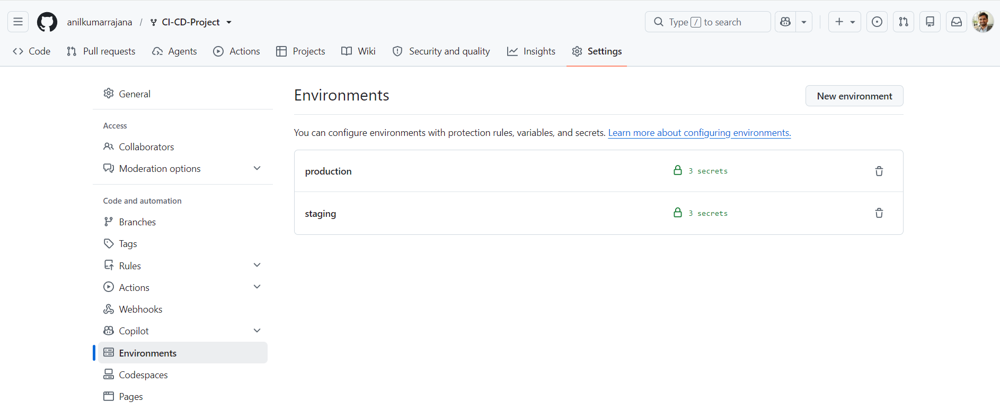
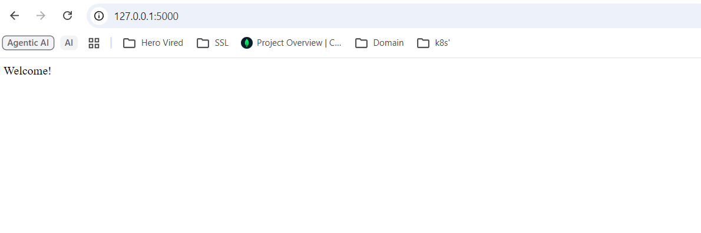

# Flask Practice App — CI/CD with GitHub Actions

This repository contains a Python Flask application with an automated
CI/CD pipeline built using **GitHub Actions**. Every push and release is
automatically tested, built, and deployed to the correct environment
without any manual steps.

---

## 1. Branch Strategy

| Branch     | Purpose                                                             |
|------------|-----------------------------------------------------------------------|
| `master`     | Stable, production-ready code. Tagged releases are cut from here.    |
| `staging`  | Pre-production branch. Pushing here auto-deploys to the staging server. |

Typical flow: feature branch → PR into `staging` → tested on staging →
merged into `master` → a **Release** is published from `master` → deployed to production.

---

## 2. What the Workflow Does

The workflow lives at [`.github/workflows/staging.yml`](.github/workflows/staging.yml)
and is made up of four jobs that run in sequence:

```
build-and-test  →  build  →  deploy-staging   (only on push to "staging")
                          └→  deploy-production (only when a Release is published)
```

### Job 1 — `build-and-test`
Runs on every push and pull request to `main` or `staging`.
- Checks out the code and sets up Python 3.11.
- Installs dependencies from `requirements.txt`.
- Lints the code with `flake8` (fails fast on syntax errors).
- Runs the test suite with `pytest` and uploads a JUnit test report as a
  workflow artifact.

### Job 2 — `build`
Runs only if `build-and-test` succeeds.
- Reinstalls dependencies and packages the application into a zip
  artifact (`flask_app_build.zip`), excluding tests, git metadata, and
  caches.
- Uploads the zip as a build artifact so later jobs (and you, from the
  Actions UI) can download it.

### Job 3 — `deploy-staging`
Runs only when the trigger is a **push to the `staging` branch**.
- Downloads the build artifact.
- Deploys it to the staging server/environment using the `staging`
  secrets (see below). The deployment commands in the workflow are
  commented out as a template — replace them with your actual host
  (SSH/SCP, Heroku, AWS Elastic Beanstalk, Docker registry push, etc.).

### Job 4 — `deploy-production`
Runs only when a **GitHub Release is published** (i.e., you tag a
release from the repo's "Releases" page or via the API/CLI).
- Downloads the same build artifact.
- Deploys it to production using the `production` secrets.

Because `deploy-staging` and `deploy-production` both `needs: build`,
neither will run unless linting, tests, and the build all succeeded first.

---

## 3. Configuring GitHub Secrets

Sensitive values are never hard-coded in the workflow — they're pulled
from **GitHub Environments/Secrets** at run time.

### Step-by-step: adding secrets

1. Go to your repository on GitHub.
2. Click **Settings → Environments**.
3. Create two environments: `staging` and `production`.
4. Inside each environment, click **Add secret** and add the values it
   needs. Suggested names (matching the workflow file):

   **`staging` environment secrets:**
   | Secret name        | Description                                  |
   |---------------------|-----------------------------------------------|
   | `STAGING_HOST`      | Hostname/IP of the staging server              |
   | `STAGING_USER`      | SSH username for deployment                    |
   | `STAGING_SSH_KEY`   | Private SSH key used to connect to the server  |

   **`production` environment secrets:**
   | Secret name         | Description                                  |
   |----------------------|-----------------------------------------------|
   | `PROD_HOST`          | Hostname/IP of the production server           |
   | `PROD_USER`          | SSH username for deployment                    |
   | `PROD_SSH_KEY`       | Private SSH key used to connect to the server  |



---

## 4. Running the App Locally

```bash
git clone https://github.com/mohanDevOps-arch/flask_Practice.git
cd flask_Practice
pip install -r requirements.txt
python app.py                 # or: flask run
```

Visit `http://127.0.0.1:5000` in your browser.



---

## 5. Running Tests Locally

```bash
pip install pytest pytest-cov
pytest --disable-warnings -q
```

---

## 6. Triggering Each Stage

| To trigger...        | Do this                                                                 |
|------------------------|--------------------------------------------------------------------------|
| CI (test only)        | Open a pull request or push to any tracked branch                       |


| Staging deployment    | `git push origin staging` (merge or push directly to `staging`)         | 


| Production deployment | On GitHub: **Releases → Draft a new release → Publish release** (tag from `main`) |

---